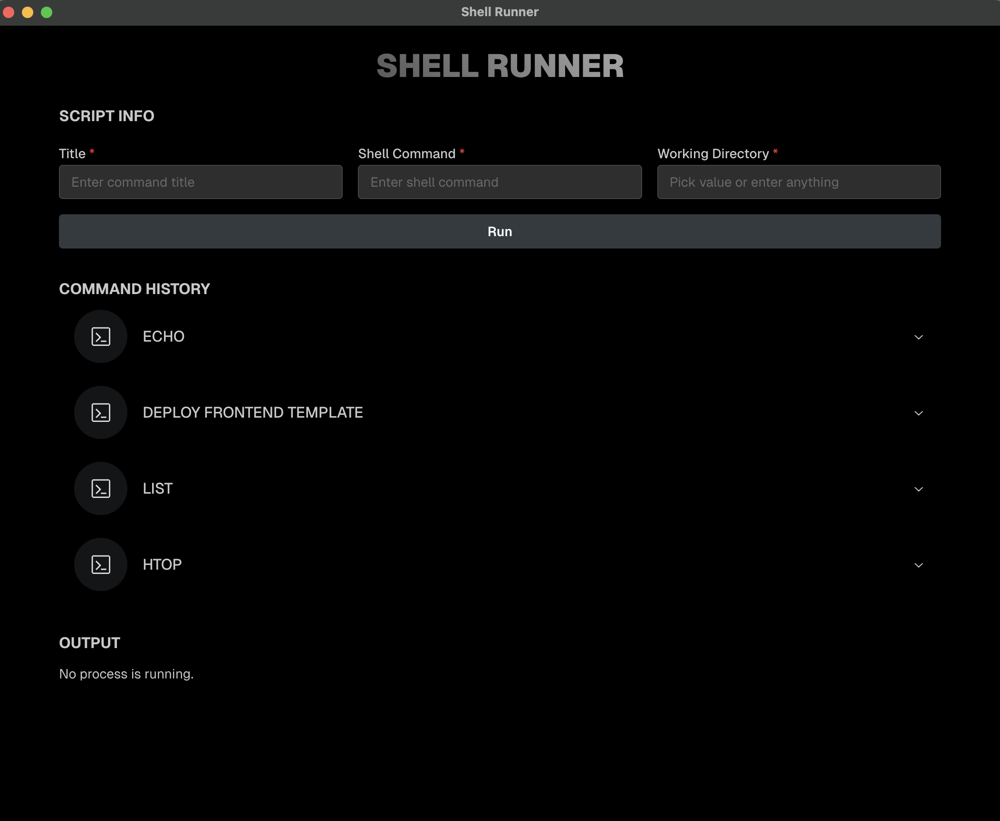
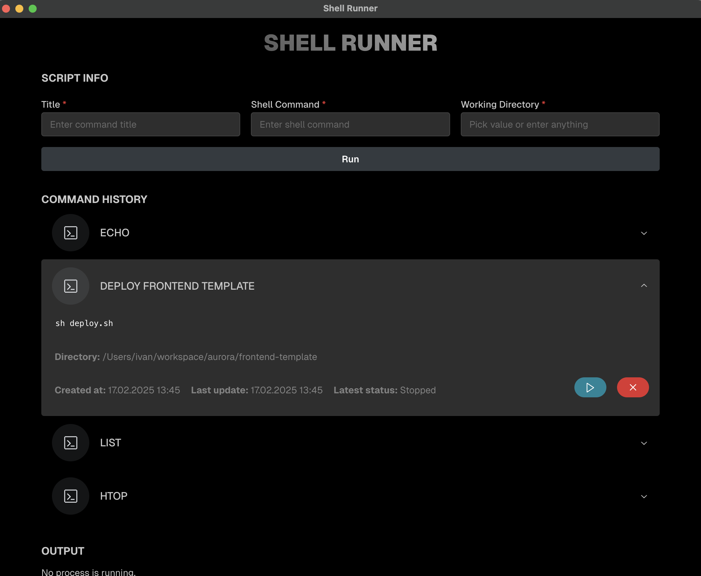
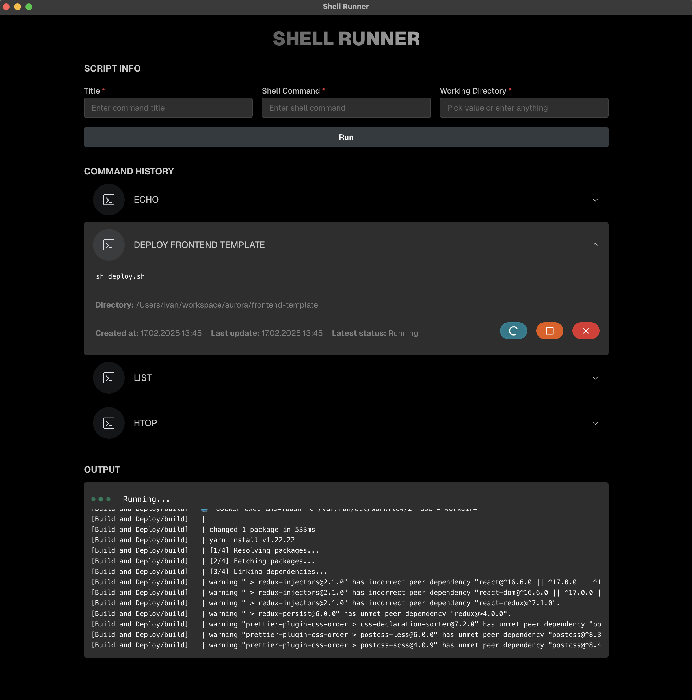

> # 🖥️ Shell Runner

**Save Once, Run Anytime!**

A lightweight app that allows you to **run, monitor, and stop shell commands** with real-time output.

This shell runner can execute any terminal command, but also can preserve history and let you re-run the command anytime you want. Once you no longer need a command, you can safely remove it from the saved list.

I created this app because I often forget commands and wanted an easy way to save and run them anytime. I also wanted a clean and user-friendly UI for executing workflows independently, without having to retype commands or rely on complex setups.

This app is built with **Electron**, **React** & **TypeScript**!

---

## ✨ Features

- ✅ **Run shell commands** from a user-friendly interface
- ✅ **View real-time command output** in the app
- ✅ **Stop running processes** (even background ones)
- ✅ **Graceful shutdown with fallback to force-kill**
- ✅ **Saves and restores last known running process**

---

## 🚀 Getting Started

### 1️⃣ Install Dependencies

```bash
npm install
```

### 2️⃣ Start the App

```bash
npm start
```

---

## 🛠️ How It Works

1. **Enter a shell command** and a **working directory**.
2. **Click "Run"** to execute the command.
3. **Live output** appears in the UI.
4. **Click "Stop"** to gracefully terminate or force-kill the process.

---

## 💡 Example Use Cases

- Running **Docker commands**
- Monitoring **background scripts**
- Automating **project builds**
- Debugging **long-running shell scripts**

---

## 📌 Examples

Here are some ways you can use **Shell Runner**:

### 🔹 Listing Files in a Directory

```bash
ls -la
```

> View all files (including hidden ones) with detailed information.

### 🔹 Running Custom Shell Scripts

```bash
bash demo.sh
```

> Execute a local script using your system’s installed **Bash**.

#### 🔹 Run GitHub workflows locally

```bash
act -j build
```

> Run your GitHub Actions workflows locally using the **`act`** CLI tool.

### 🔹 Checking Running Docker Containers

```bash
docker ps
```

> Quickly check running **Docker containers** on your local machine.

### 🔹 Monitoring System Resources

```bash
htop
```

> Open **HTOP**, a real-time system monitoring tool (must be installed).

---

## 📸 Screenshots







---

## ⚡ Development & Hot Reload

For continuous **auto-rebuild**, run:

```bash
npm start
```

---

## 🛑 Stopping a Running Process

The app **first tries SIGTERM** (graceful stop), then **forces SIGKILL** if needed.

You can also manually check process status:

```bash
kill -0 <PID> && echo "Running" || echo "Not running"
```

---

## 📜 License

MIT License © 2025 Ivan Vulović
